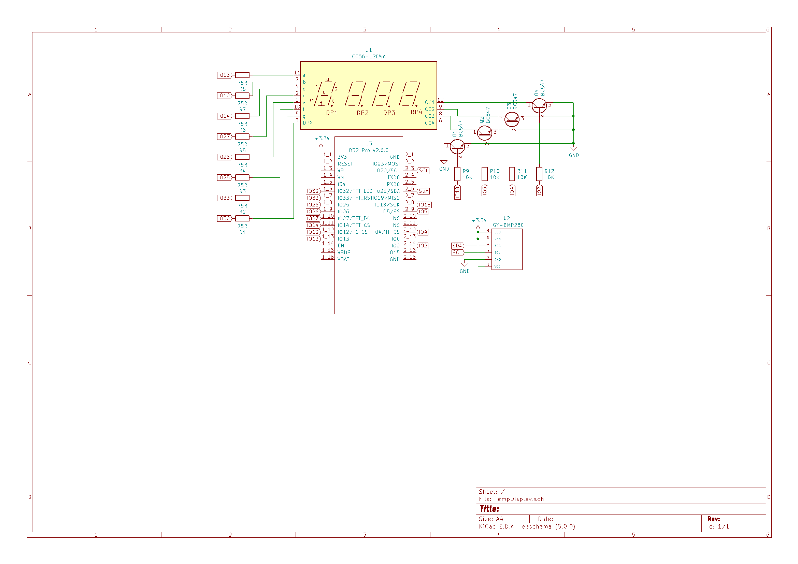
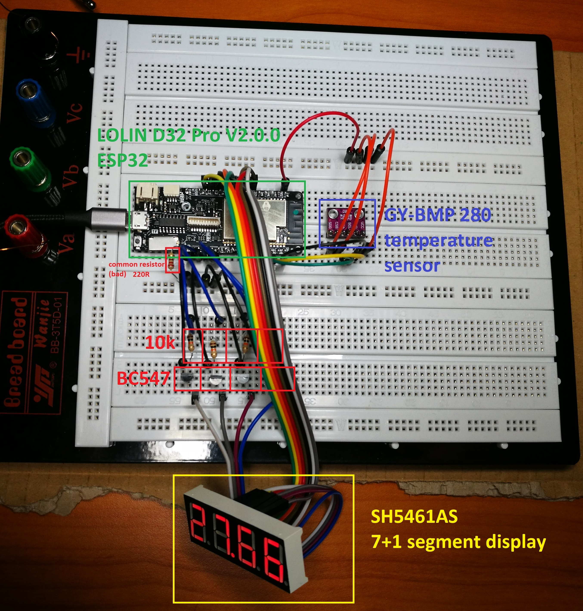
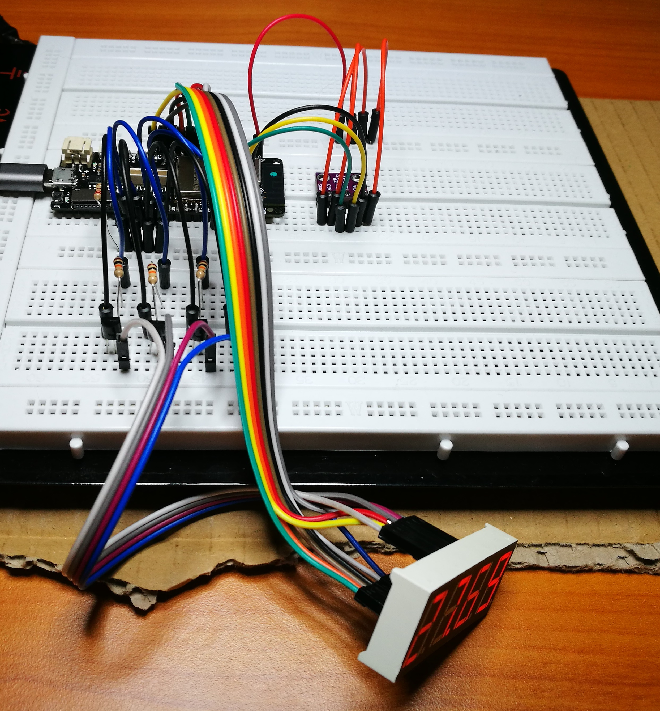

# Introduction
This project is an example of how to use a board with many I/O-pins, a temperature sensor and a digit display to build a thermometer. My version updates every 10 seconds.

# Description

The digit display does **not** have an anode for each segment it has. Instead, just 8 of its pins are anodes, connected to the same segment of the 4 different digit-parts.
The other 4 pins are the cathodes. One for each digit-part.  
But now it is only possible to display the same digit on 4 digit-parts (e.g. "2222", "7777"). That sucks, right? There is a special method to address this problem.  
The solution is to iterate over the digits of the number to display, show only one digit at a time and ground the correct pin by applying voltage to the base of the desired transistor. This process will repeat so often and so fast that the human eye is unable to see the flickering. If desired, it is possible to make the flickering visible by adding a little delay (e.g. 10ms).

The temperature is read via the I²C interface. If the initial connect fails, the display will show "FAIL".

My code is available in the *TempDisplay.ino* file.

# Components
The required components are:

- Board with many I/O-pins: **LOLIN D32 Pro V2.0.0**
- Temperature sensor: **GY-BMP 280**
- Digit display: **7+1 segment SH5461AS**

and

- Resistors
  - 8x 75Ω (for the digit display)
  - 4x 10kΩ (for the transistors)
- Transistors
  - 4x BC547

The components can be substituted, these are just my recommendations. The voltage applied to the sensor and the display should be at 3.3V.

Here is a schematic I created in KiCad:

# My setup

Note that I didn't use 8x 75Ω resistors, because I didn't have them handy. Instead I just used one 220Ω resistor, which is bad, but it works.

  

